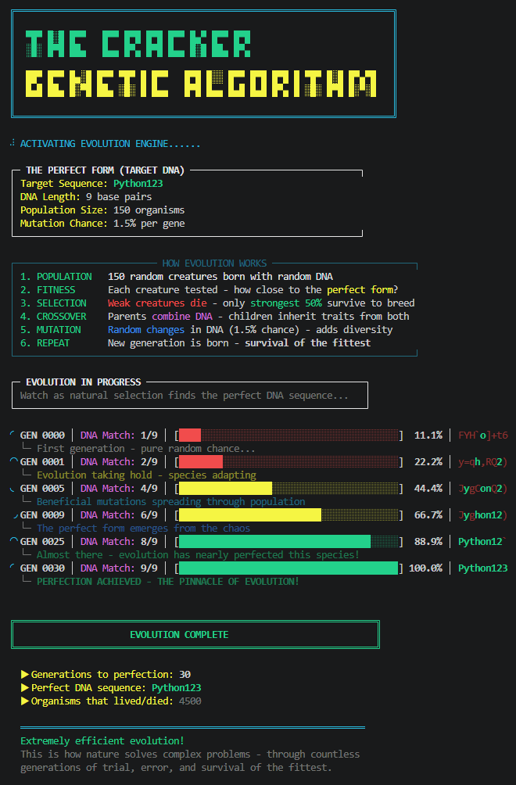

# Genetic Password Cracker

A visual demonstration of evolutionary computation - watch natural selection crack a password in real-time.

## Overview

Genetic Password Cracker is an educational tool that demonstrates how **Genetic Algorithms** solves optimization problems through simulated evolution.
Instead of brute-forcing every combination, the algorithm breeds generations of candidate passwords, selecting the fittest individuals to pass their "DNA" to offspring through crossover and mutation.

This project visualizes evolution in action with a color-coded terminal interface, showing fitness progression, population diversity, and the emergence of the target password.

## Features

- **Real-time evolution visualization** – Watch fitness improve generation by generation
- **Color-coded DNA display** – Green = correct character, Red = incorrect
- **Animated progress bar** – Visual feedback showing evolutionary progress
- **Configurable parameters** – Adjust population size, mutation rate, and target password
- **Elitism preservation** – Best individuals survive unchanged to next generation
- **ASCII banner & spinner** – Hacker-style aesthetic with smooth animations

## How It Works

This implementation follows the standard **Genetic Algorithm** framework as described in both [Wikipedia](https://en.wikipedia.org/wiki/Genetic_algorithm) and [GeeksforGeeks](https://www.geeksforgeeks.org/dsa/genetic-algorithms/), demonstrating how evolutionary principles can efficiently search complex solution spaces.

| GA Component | Implementation |
|:---|:---|
| **Population** | `POPULATION_SIZE` random strings |
| **Fitness Function** | Count of matching characters at correct positions |
| **Selection** | Top 50% of population chosen as parents |
| **Crossover** | One-point crossover combining two parent strings |
| **Mutation** | Random character changes at `MUTATION_RATE` probability |
| **Elitism** | Top `ELITE_SIZE` individuals preserved unchanged |
| **Termination** | Algorithm stops when target password is found |

## Screenshot



*The evolution process: each generation shows improving fitness, color-coded DNA matches, and a progress bar tracking convergence toward the target password.*

## Requirements

- Python 3.6 or higher
- No external libraries required (uses only standard library modules)
- Terminal with ANSI color support (all modern terminals)

## Installation & Setup

### 1. Clone the Repository
```bash
git clone https://github.com/yourusername/genetic-password-cracker.git
cd genetic-password-cracker
```

### 2. Run the Script
```bash
python password_cracker.py
```

### 3. Configure Parameters (Optional)
Edit the constants at the top of the script:
```python
TARGET = "python123"        # Password to crack
POPULATION_SIZE = 200       # Individuals per generation
MUTATION_RATE = 0.02        # Chance of random gene mutation
ELITE_SIZE = 2              # Best individuals preserved each generation
```

## Usage

1. Run the script in your terminal
2. Watch as random strings evolve toward the target password
3. Green characters indicate correctly guessed positions
4. The progress bar fills as fitness improves
5. Final output shows total generations required and success message

## Educational Value

This project demonstrates key evolutionary computing concepts:
- **Natural Selection** – Only the fittest individuals reproduce
- **Inheritance** – Offspring inherit traits from both parents
- **Mutation** – Random changes introduce genetic diversity
- **Convergence** – Population gradually approaches optimal solution

The generation count proves that evolution efficiently finds solutions without exhaustive search — the same principle that powers optimization in machine learning, scheduling, and engineering design problems.

## Acknowledgments

- Algorithm based on standard GA methodology: [Wikipedia](https://en.wikipedia.org/wiki/Genetic_algorithm)
- Implementation reference: [GeeksforGeeks Genetic Algorithms Guide](https://www.geeksforgeeks.org/dsa/genetic-algorithms/)

## License

This project is licensed under the **MIT License**.  
See the [LICENSE](LICENSE) file for more details.
